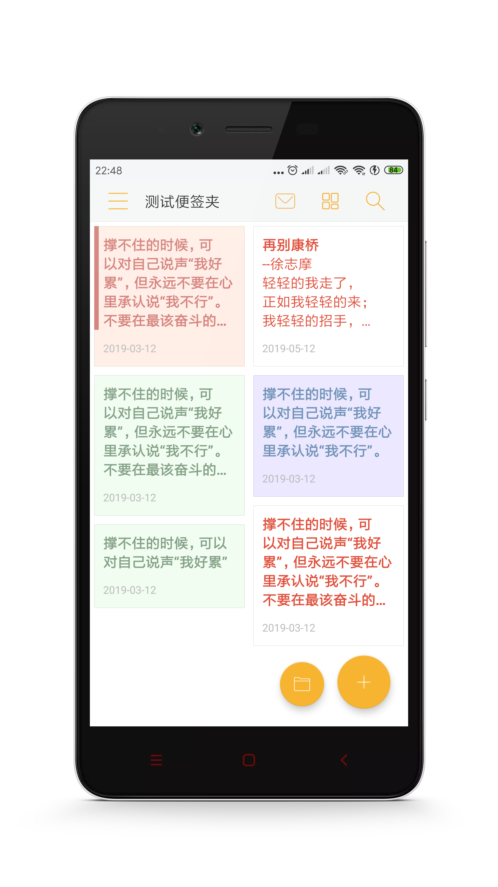
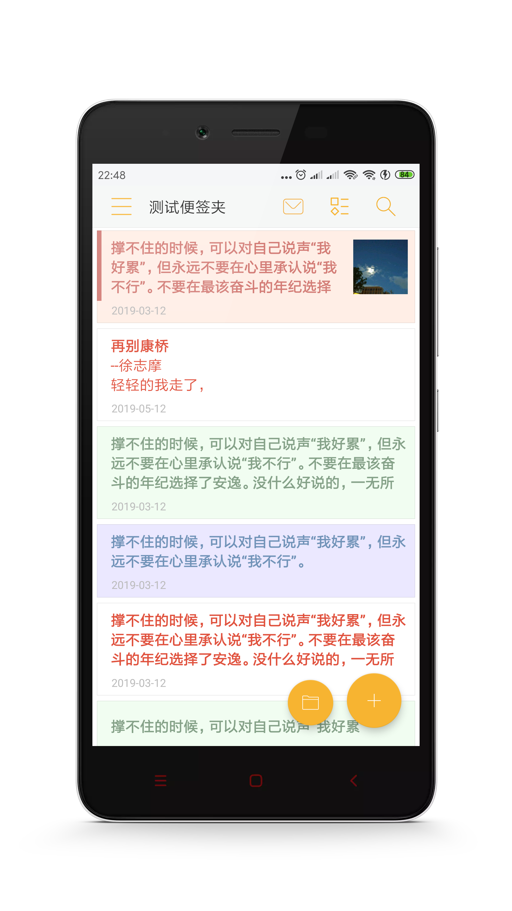

# 1. 首页简介

## 1.1 首页图解

打开便签，首页进入的就是首页。

------

### 1.2 显示模式

点击图标，可以切换首页的**显示模式**，主要有如下几种：

- **单行模式**
- **网格模式**
- **瀑布流模式**
- **图文模式**

下面，分别介绍一下几种模式的区别。

#### 1.2.1 单行模式 (显示第一行内容)

#### 1.2.2 网格模式 (显示前3行内容)

#### 1.2.3 瀑布流模式 (显示前5行内容)

#### 1.2.4 图文模式 (显示前3行内容+第一张图片)

------

### 1.2 首页排序

#### 1.2.1 自动排序

- 首页默认使用`按创建时间倒序(拖拽排序优先)`的排序方式。
- 关于如何修改排序方式，请参考[设置-首页的排序方式修改](Setting/Home/首页排序方式.md)

#### 1.2.1 拖拽排序

- 通过**长按**便签首页的便签，可以进入编辑模式，在`单行模式`和`图文模式`两种显示模式下，可以通过拖拽右侧图标**上下移动**进行排序。

------

