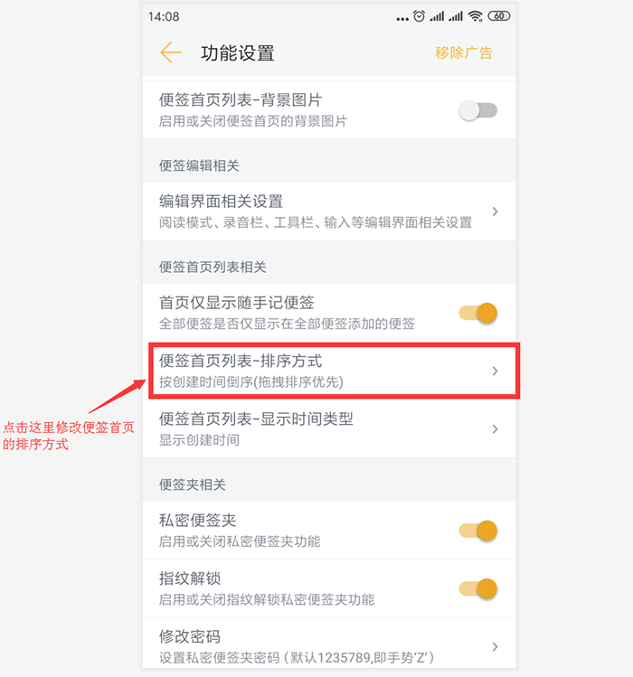

# 首页排序方式

## 如何修改排序方式？

- 点击便签夹右下角的设置，进入`设置界面`；
- 下滑到下图的位置，点击红框中的选项；

## 有哪些排序方式？

### ① 按创建时间倒序(拖拽排序优先)-默认

- 表示先创建的便签排在最上面，且拖拽排序过的部分内容将不受创建时间影响。

### ② 按创建时间顺序(拖拽排序优先)

- 表示先创建的便签排在最下面，且拖拽排序过的部分内容将不受创建时间影响。

### ③ 按创建时间倒序(忽略拖拽排序)

- 表示先创建的便签排在最上面，且拖拽排序不生效。

### ④ 按创建时间顺序(忽略拖拽排序)

- 表示先创建的便签排在最下面，且拖拽排序不生效。

### ⑤ 按修改时间倒序(拖拽排序优先)-默认

- 表示新修改的便签排在最上面，且拖拽排序过的部分内容将不受修改时间影响。

### ⑥ 按修改时间顺序(拖拽排序优先)

- 表示新修改的便签排在最下面，且拖拽排序过的部分内容将不受修改时间影响。

### ⑦ 按修改时间倒序(忽略拖拽排序)

- 表示新修改的便签排在最上面，且拖拽排序不生效。

### ⑧ 按修改时间顺序(忽略拖拽排序)

- 表示新修改的便签排在最下面，且拖拽排序不生效。

### ⑨ 按首数字或首字母排序(忽略拖拽排序)

- 表示按便签内容的第一个字符排序；
  - 如果是数字，则从0开始排序；
  - 如果是中文，则按拼音的首字母开始排序；
  - 如果是字母，则按字母顺序排序；

